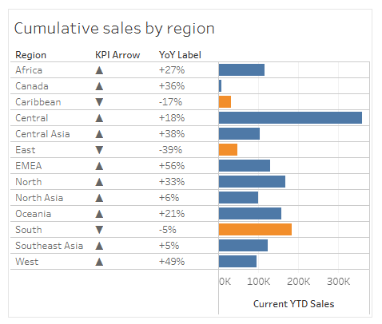
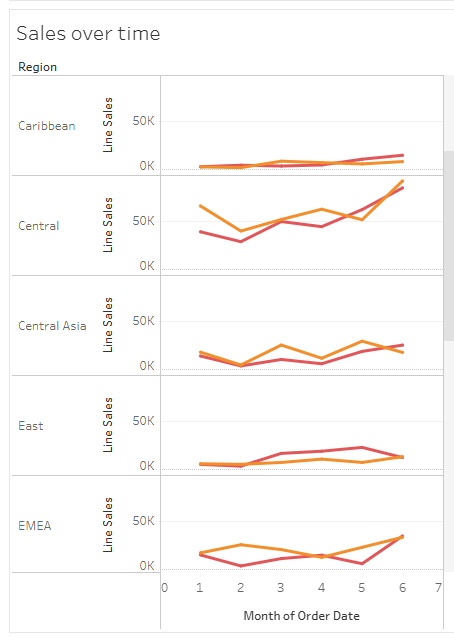

# IT5425 — Year-to-Date & Year-over-Year Dashboard

Recreate and **analyze** the "Showing Year-to-date and Year-over-Year at the Same Time" dashboard (Chapter 10, *The Big Book of Dashboards* — Wexler, Shaffer & Cotgreave) on the Global Superstore dataset: process the data in Python → build the dashboard in Tableau → critique the design (what works, what doesn't, and the alternative).

Source material: [`docs/Chapter 10 ...pdf`](docs/Chapter%2010%20Showing%20Year-to-date%20and%20Year-over-Year%20at%20the%20Same%20Time.pdf).

---

## 1 · Scenario & goal

**Scenario (from the book).** You were promoted in June to manage sales across several regions. Your number-one goal: by year-end, each region's sales must be **higher than last year's**. You need a mobile-friendly dashboard that, *in a single screen*, lets you:

- Rank **YTD** (year-to-date) sales by region and compare against the **previous year** (year-over-year, YoY).
- See at a glance which regions are **ahead / behind**, and by *how much*.
- See **trends** to know whether you're on track.
- Drill into a specific region / time period on demand (details on demand).

**Adaptation for this project.** The book uses fictional data with 6 regions (Katonah, Croton, Brewster…). This project substitutes the real **Global Superstore** dataset and uses the `Region` column (13 values) as the *location dimension* — a choice validated numerically in section 1.3 of the notebook. Comparison window: **YTD through June**, current year **2014** vs previous year **2013** (matching the "promoted in June" anchor in the scenario).

**The course objective is not just to rebuild the chart, but to *analyze the design*** — see [4 · Dashboard analysis](#4--dashboard-analysis).

---

## 2 · Dataset

| | |
|---|---|
| Source | Global Superstore (`data/raw/superstore.csv`) |
| Size | 51,290 rows × 24 columns, `cp1252` encoding |
| Date range | 2011-01-01 → 2014-12-31 |
| After processing | 6 columns, ~2 MB (17% of the original) — `data/processed/superstore_dashboard.csv` |

The dashboard really only needs **3 source fields**: `Order Date`, `Region`, `Sales`. The pipeline adds 3 date helpers to make Tableau's date logic simpler.

---

## 3 · Repo layout & workflow

```
.
├── docs/                       # Chapter 10 (PDF) — the brief & basis for the analysis
├── data/
│   ├── raw/superstore.csv      # input (Global Superstore)
│   └── processed/…csv          # pipeline output, the source for Tableau
├── notebooks/
│   └── 01_processing_pipeline.ipynb   # Phase 1: inspection + cleaning
├── workbooks/
│   ├── superstore_YTD_YOY_v1.twbx     # first build
│   ├── superstore_YTD_YOY_v2.twbx     # adds the "YoY difference" view
│   └── superstore_YTD_YOY_v3.twbx     # final build (current)
├── Dockerfile / docker-compose.yml    # JupyterLab for running the notebook
└── requirements.txt
```

### Phase 1 — Data pipeline (`notebooks/01_processing_pipeline.ipynb`)

The notebook has two parts, with every step checked numerically:

1. **Inspection** — load, audit (`Order Date` parses? `Sales` non-negative? `Row ID` unique?), confirm both comparison years have data in the YTD window, and **choose the location dimension** (section 1.3): score all 6 geographic columns (`City`, `State`, `Country`, `Postal Code`, `Market`, `Region`) against 6 criteria (cardinality, label consistency, year-over-year stability, balanced distribution, coverage, hierarchy) → conclude `Region`.
2. **Pipeline** — parse dates, trim `Region`, keep only the 3 columns the dashboard needs, add `Order Year` / `Order Month` / `Order YearMonth`, sort by date, validate, then write `superstore_dashboard.csv`.

### Phase 2 — Tableau build (`workbooks/*.twbx`)

Two **parameters** drive the whole dashboard, letting you change the as-of point without touching the data:

| Parameter | Default | Meaning |
|---|---|---|
| `Current Year` | 2014 | The "current" year to rank |
| `As Of Month` | 6 | YTD computed through this month |

The core **calculated fields** (taken from workbook v3):

```
Current YTD Sales   = IF YEAR([Order Date]) = [Current Year]
                         AND MONTH([Order Date]) <= [As Of Month] THEN [Sales] END
Previous YTD Sales  = IF YEAR([Order Date]) = [Current Year] - 1
                         AND MONTH([Order Date]) <= [As Of Month] THEN [Sales] END

YoY % Diff          = (SUM([Current YTD Sales]) - SUM([Previous YTD Sales]))
                       / SUM([Previous YTD Sales])
KPI Status          = IF SUM([Current YTD Sales]) >= SUM([Previous YTD Sales])
                         THEN "Ahead" ELSE "Behind" END
KPI Arrow           = IF … >= … THEN "▲" ELSE "▼" END     -- redundant icon, color-blind safe
YoY Label           = (IF [YoY % Diff] >= 0 THEN "+" ELSE "" END)
                       + STR(ROUND([YoY % Diff]*100,0)) + "%"

-- for the trend line & difference view
Line Sales            = sales within the YTD window, split by Current/Previous Year
Cumulative Line Sales = RUNNING_SUM(ZN(SUM([Line Sales])))
YoY Cumulative Diff   = RUNNING_SUM(ZN(SUM([Current YTD Sales])))
                        - RUNNING_SUM(ZN(SUM([Previous YTD Sales])))
```

**Worksheets:** `Cumulative sales by region` (bar chart + previous-year reference line + KPI icon), `Sales over time` (current vs previous trend line), `YoY cumulative difference` (the difference view — Cotgreave's alternative).

**Dashboards:** `Showing Year-to-date and Year-over-Year at the Same Time` (the main, mobile-first dashboard) and `YoY Difference (Cotgreave alternative)`.

| `Cumulative sales by region` | `Sales over time` |
|---|---|
|  |  |
| Ranked YTD bars with the `KPI Arrow` (▲/▼) and `YoY Label` columns. | Per-region trend lines comparing the current and previous year. |

**Build history:** v1 (main dashboard only) → v2 (adds the "YoY difference" sheet & dashboard) → **v3** (final build, used for grading).

---

## 4 · Dashboard analysis

This is the heart of the assignment: *why* the design works, and *when* to choose something else.

### ✅ What works — "Why this works"

- **Bars for comparing magnitude.** The eye instantly sees which region is twice another — no mental math like a table.
- **Reference line = previous-year sales.** One glance tells you which region is ahead/behind and by how far — without reading numbers.
- **Good color & legend placement.** Current year in dark green (the primary concern), previous year in light gray; the legend is tucked inside the chart, taking no extra mobile screen space.
- **KPI icon (▲/▼) as redundant encoding.** The arrow shape + position signals "problem" even for color-blind users, independent of the red color.
- **Numbers placed *inside* the bars.** Saves room on a smartphone and avoids colliding with the reference line (placing numbers outside cramps the chart).
- **Line chart for trends.** Answers what a table can't: did the gap with last year appear recently or persist all year? Is it narrowing or widening?
- **Selection + details on demand.** Tap a point to see that month's detail; the "See details" link jumps to deeper data.
- **Mobile-first, single scrolling flow.** A summary of the regions up top, scroll down to see the trend of an underperforming region.

### ❌ What's weak — approaches to avoid

- **The traditional scorecard table (Figure 10.10).** Not ugly, but it *makes the reader work*: you have to do mental math to realize the top region is ~3× the lowest, and imagine bar lengths from the "% difference" column. The bar chart + reference line does that work for you.
- **Bar-in-bar + goal + side trend lines (Figure 10.11, Steve's draft).** Cramming current vs previous vs goal into one place means too much to parse and ambiguity (is the % column vs last year or vs the goal?). The side trend lines get squeezed in height, so only the most obvious gaps show.

### 🔄 The alternative — Andy Cotgreave

- Instead of plotting *both years* on top of each other, plot the **YoY difference** directly (area chart, `YoY Cumulative Diff`). Problems in weak regions show up with **absolute clarity** — you see exactly how bad it is.
- **Trade-off:** the difference view (left) gives the *exact gap* but loses *actual cumulative sales*; the overlaid-years view (right) is the reverse. You can add a **switch** to toggle between the two views rather than cramming both in (keeping the dashboard simple enough that people actually use it).
- **In defense of tables:** when the primary task is *looking up exact numbers* (not fast comparison), a highlight table can beat a chart.

> This project builds **both** directions — the main dashboard (bars + trend) and the Cotgreave version (YoY difference) — to compare the two ways of telling the story side by side.

---

## 5 · How to run

**Data pipeline (notebook):**

```bash
docker compose up --build       # open http://localhost:8888 (no token required)
```

JupyterLab runs at `/workspace`; `notebooks/` and `data/` are bind-mounted, so edits are written straight back to your machine. Open `notebooks/01_processing_pipeline.ipynb` and Run All → produces `data/processed/superstore_dashboard.csv`.

**Dashboard (Tableau):** open `workbooks/superstore_YTD_YOY_v3.twbx` in Tableau Desktop / Public. The `.twbx` bundles the data, so it opens ready to run; adjust the `Current Year` / `As Of Month` parameters to change the comparison point.

---

## 6 · Notes

- The notebook hardcodes `CURRENT_YEAR = 2014` and `AS_OF_MONTH = 6` to **validate** the data; in Tableau those same two anchors are **parameters** for interaction.
- Globally, the true location key is the pair `(Market, Region)` — `Central`/`North`/`South` repeat across multiple markets. The dashboard currently aggregates by `Region` (13 bars); see notebook section 1.3 for when to switch to a composite `Market · Region`.
